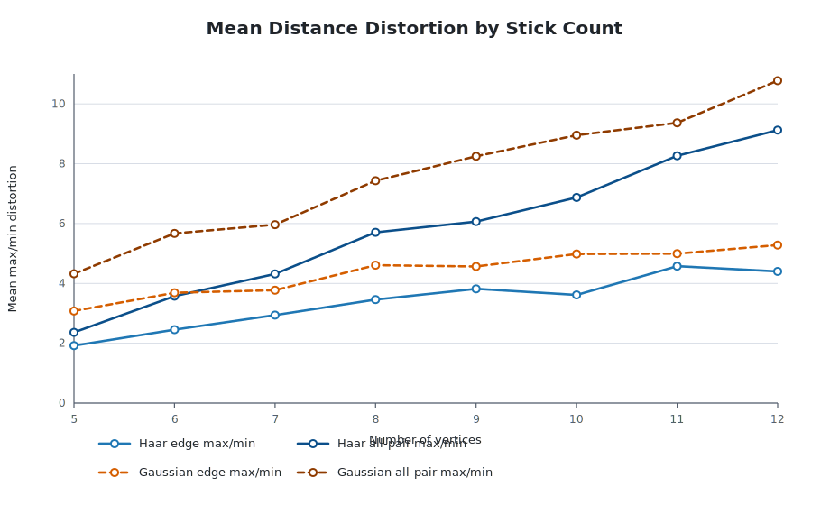
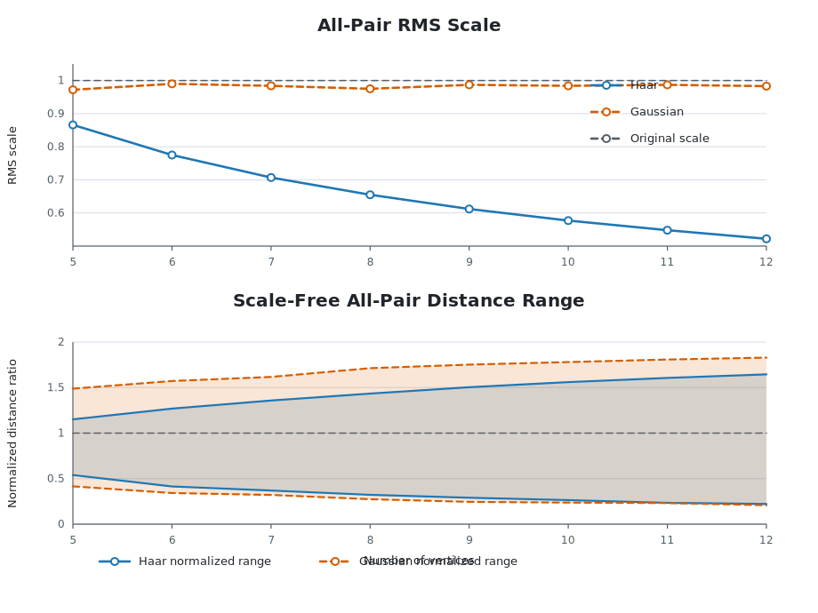

Experiments
===========

The first tracked run used 250 samples for each :math:`N=5,\ldots,12` with
seed ``20260524``.  Full command lines and knot-label details are in
``reports/haar_vs_gaussian_N5-12_250.md``.

The current manuscript run uses 1000 samples for each :math:`N=5,\ldots,12`
with seed ``20260604``.  At :math:`N=6`, the direct classifier Monte Carlo gives
``2/1000 = 0.002`` trefoils in the Haar model and ``5/1000 = 0.005`` trefoils
in the raw Gaussian comparison.  These are consistent with the targeted
order-type bucket estimate

.. math::

   \widehat p_6(3_1)=1856/500000=0.003712,

whose Wilson 95 percent interval is ``0.003547--0.003884``.  The direct
1000-sample intervals are much wider, so the direct run is a sanity check rather
than a sharp estimator of the six-stick trefoil probability.

Knot frequencies
----------------

Haar model:

.. list-table::
   :header-rows: 1

   * - :math:`N`
     - classified
     - nontrivial
     - trivial
     - unknown
     - nontrivial rate
   * - 5
     - 250
     - 0
     - 250
     - 0
     - 0.000
   * - 6
     - 250
     - 1
     - 249
     - 0
     - 0.004
   * - 7
     - 250
     - 1
     - 249
     - 0
     - 0.004
   * - 8
     - 250
     - 8
     - 242
     - 0
     - 0.032
   * - 9
     - 250
     - 9
     - 241
     - 0
     - 0.036
   * - 10
     - 250
     - 27
     - 223
     - 0
     - 0.108
   * - 11
     - 249
     - 29
     - 220
     - 1
     - 0.116
   * - 12
     - 248
     - 36
     - 212
     - 2
     - 0.145

Gaussian model:

.. list-table::
   :header-rows: 1

   * - :math:`N`
     - classified
     - nontrivial
     - trivial
     - unknown
     - nontrivial rate
   * - 5
     - 250
     - 0
     - 250
     - 0
     - 0.000
   * - 6
     - 250
     - 1
     - 249
     - 0
     - 0.004
   * - 7
     - 250
     - 6
     - 244
     - 0
     - 0.024
   * - 8
     - 250
     - 7
     - 243
     - 0
     - 0.028
   * - 9
     - 250
     - 20
     - 230
     - 0
     - 0.080
   * - 10
     - 250
     - 24
     - 226
     - 0
     - 0.096
   * - 11
     - 250
     - 24
     - 226
     - 0
     - 0.096
   * - 12
     - 250
     - 30
     - 220
     - 0
     - 0.120

Metric deformation
------------------

The original simplex has all pairwise distances equal to :math:`\sqrt{2}`.  The
figures below report the mean Hamiltonian edge max/min distortion, the mean
all-pair max/min distortion, the all-pair RMS distance divided by
:math:`\sqrt{2}`, and the scale-free all-pair min/max range after RMS
normalization.

   Mean Hamiltonian-edge and all-pair max/min distance distortions.

   All-pair RMS scale and scale-free all-pair distance range.
